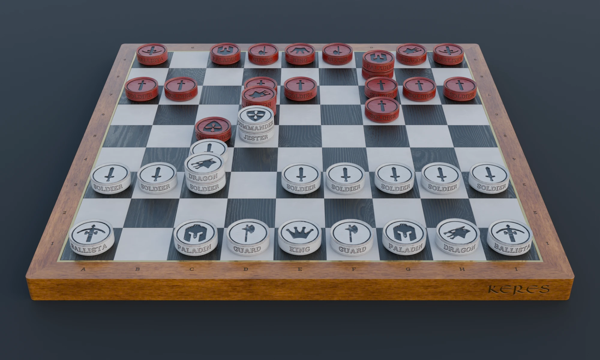
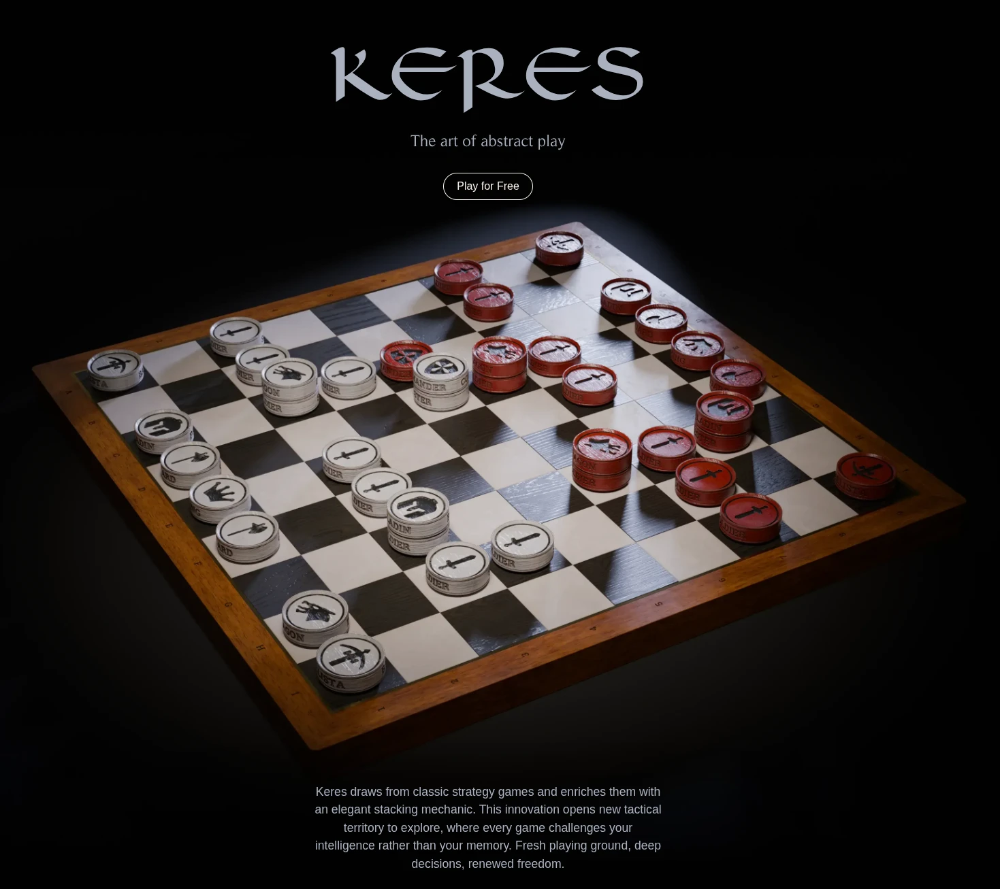
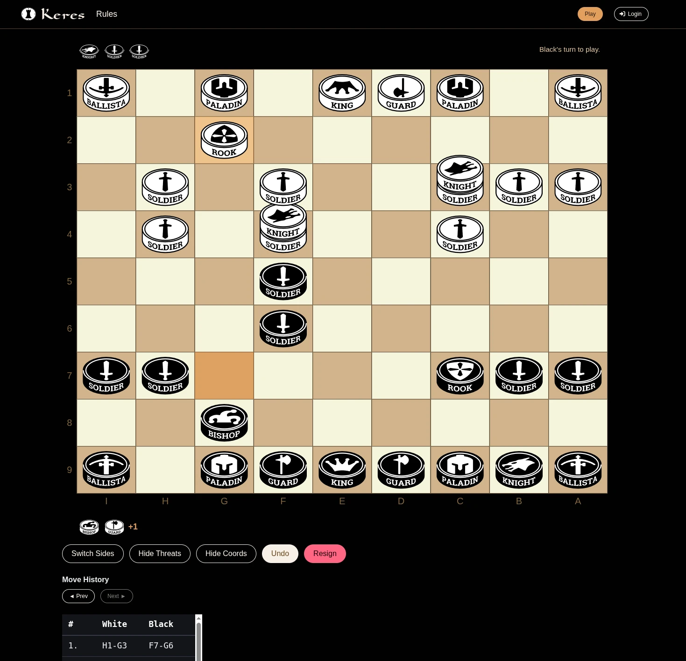
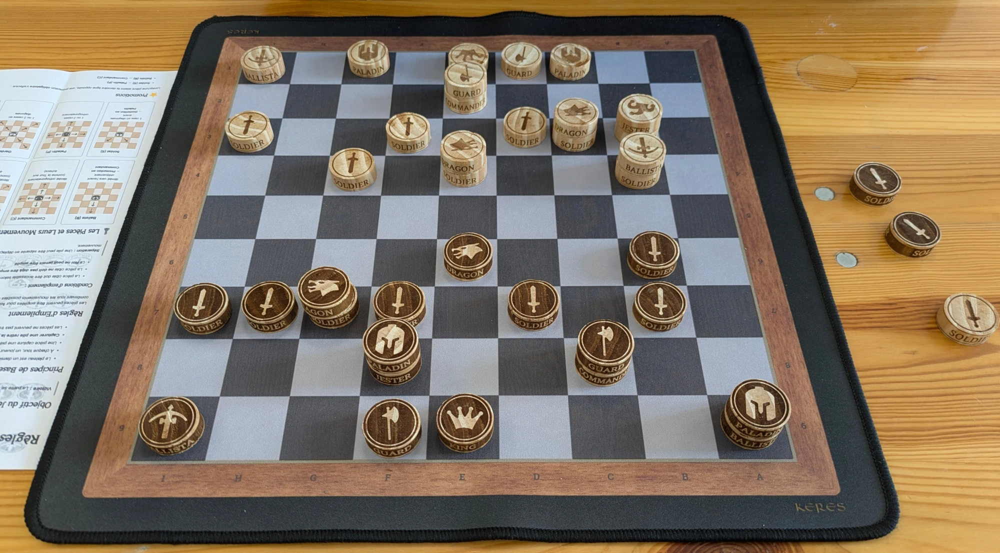

# Keres — Abstract Strategy Game Platform


> A multiplayer platform for **Keres**, an original abstract strategy game designed for depth through simplicity.  
> Play against a strong AI, challenge a friend in hotseat mode, or watch the engine think.

🎮 **[Play now at playkeres.com](http://playkeres.com)**



---

## Why this project exists

Keres is a 10-year-old game design project — tested repeatedly with real players, refined over time, and finally built
into a proper platform. The rules are simpler than Chess (no special cases, no exceptions), but the complexity is
emergent: stacking mechanics create tactical patterns that don't exist in other abstract games.

Building a platform for an abstract strategy game forces you to solve interesting problems: you need either a strong AI
opponent or a live multiplayer system (ideally both), a game engine that's correct and fast, and an interface that makes
the game legible to new players.

This repository is the result of building all of that solo, from scratch.

---

## What makes this technically interesting

### The game engine is fully decoupled

The Rust engine is the single source of truth for all game logic. Symfony never interprets game state — it stores and
forwards raw binary-serialized move sequences. This means the platform is **game-agnostic by design**: swapping in a
different combinatorial game would require only a new engine binary, not a rewrite of the platform.

### Binary wire format

Board state and legal move lists are serialized in a compact binary format for communication between the Rust engine and
the Symfony backend. This keeps payloads minimal and forces a clean separation between game logic and platform logic.

### Real-time via Mercure

Multiplayer updates are pushed server-side via [Mercure](https://mercure.rocks/). The infrastructure for live
multiplayer is already in place — matchmaking and time controls are the remaining pieces.

### SVG rendering pipeline

The game board and pieces are rendered entirely in SVG, generated from TypeScript. The rendering is highly optimized:
the DOM is updated minimally on each move. A Three.js renderer with custom glTF assets (painted in Substance Painter) is
in development for a more immersive perspective view.

---

## The AI engine

The AI uses **Negamax with alpha-beta pruning**, parallel search via [Rayon](https://github.com/rayon-rs/rayon), and *
*quiescence search** to avoid horizon effect.

```
Search depth:    4 ply (fixed horizon)
Quiescence:      enabled post-horizon
Move ordering:   MVV-LVA (Most Valuable Victim – Least Valuable Aggressor)
Parallelism:     Rayon (work-stealing thread pool)
Response time:   ~200ms on modern CPU, ~2-3s on a 2 vCPU VPS
```

At depth 4, the engine makes **zero tactical errors**. It finds mid-game combinations that exploit Keres's stacking
mechanic in ways that have no Chess equivalent — and independently converges on the same opening lines that experienced
human players discover.

### Why not MCTS?

Monte Carlo Tree Search with random playouts is a poor fit for Keres. Unlike Go, Hex, or Amazons — where random play
reliably reaches a terminal state — Keres doesn't guarantee game termination under random play. The stacking mechanic
creates positions where random moves loop indefinitely, making rollout quality useless as a signal.

Modern MCTS (AlphaZero-style) would require training a policy/value network with PUCT — a separate project entirely. The
current Negamax approach is stronger, faster, and fully deterministic.

GPU-accelerated MCTS was prototyped but abandoned: CPU↔GPU memory transfer overhead dominates at the tree sizes relevant
here, making it slower than CPU-only search.

---

## Architecture overview

```
                ┌──────────────────────────────────────────────────┐
                │       Cloudflare (prod) / Traefik (dev)          │
                │            TLS termination (both envs)           │
                │   Prod: Infomaniak DNS-01 → LetsEncrypt          │
                │   Dev:  Infomaniak DNS-01 → LetsEncrypt          │
                │          (real certs for *.local.playkeres.com)  │
                └─────────┬────────────────────────┬───────────────┘
                          │                        │
          Host: playkeres.com        Host: app.playkeres.com
          (dev: local.playkeres.com) (dev: app.local.playkeres.com)
                          │                        │
        ┌─────────────────▼─────────┐  ┌───────────▼──────────────────┐
        │  Hugo static build        │  │  FrankenPHP / Symfony        │
        │  Prod: Cloudflare Pages   │  │  - OIDC auth                 │
        │  Dev:  Hugo server Docker │  │  - /play* (twig+Vite)        │
        │  + /api/contact POST      │  │  - /api/* (engine proxy +    │
        │    (CORS to app subdomain)│  │       contact endpoint)      │
        └───────────────────────────┘  │  - /.well-known/mercure      │
                                       └──────┬───────────┬───────────┘
                                              │           │
                                        ┌─────▼───┐  ┌────▼─────┐
                                        │ Postgres│  │ Rust:3000│
                                        └─────────┘  └──────────┘

Vite dev server: routed via Traefik at vite.app.local.playkeres.com
                 (no direct port publish, no TLS in Vite itself)
```

---

## Stack

| Layer       | Technology       | Notes                                  |
|-------------|------------------|----------------------------------------|
| Game engine | Rust             | Negamax, alpha-beta, quiescence, Rayon |
| Backend     | Symfony (PHP)    | Game-agnostic platform, PostgreSQL     |
| Frontend    | TypeScript + SVG | Optimized DOM updates                  |
| 3D renderer | Three.js + glTF  | In development                         |
| Real-time   | Mercure          | Server-sent events                     |
| Static site | Hugo             | Marketing pages on playkeres.com       |
| Infra       | Docker Compose   | Dev at root, prod under deploy/        |

---

## Screenshots

> 

> 

---

## The physical version

Keres is also being developed as a physical product. Current prototype uses laser-engraved wooden tokens. The first
production series uses turned Jura wood pieces, engraved with an [xTool F1](https://www.xtool.com/products/xtool-f1).

The web platform and physical product are complementary distribution channels: the platform reaches players who prefer
digital play; the physical version targets events and influencer seeding.

> 
 
---

## Status & roadmap

| Feature                      | Status         |
|------------------------------|----------------|
| Hotseat (local 2-player)     | ✅ Live         |
| AI opponent                  | ✅ Live         |
| User accounts / auth         | 🔧 In progress |
| Session tracking & analytics | 🔧 In progress |
| Online multiplayer           | 📋 Planned     |
| Time controls & matchmaking  | 📋 Planned     |
| Adjustable AI difficulty     | 📋 Planned     |
| Three.js renderer            | 📋 Planned     |
| Mobile-optimized UI          | 📋 Planned     |

**Alpha:** live at [playkeres.com](http://playkeres.com)  
**Private beta:** Q2 2026  
**Public beta:** Q3 2026

---

## Development approach

This project is built with heavy AI-assisted development (Claude, GPT-4, OpenRouter). All generated code is reviewed and
architecture decisions are made explicitly — the AI is an accelerator, not the author. Several complete engine rewrites
were done to avoid iterating on poor foundations; each rewrite started from cleaner specifications derived from the
previous version's lessons.

---

## About the game

Keres is an original abstract combinatorial game with emergent complexity. The rules are simpler than Chess — no special
cases, no exception moves — but the stacking mechanic creates a tactical depth that rewards long-term planning. The game
has been playtested with real players over 10+ years before this platform was built.

A full rules explanation is available at [playkeres.com/rules](http://playkeres.com/rules).

---

## Development

The dev environment runs the full split stack — Symfony app, Rust engine, Postgres,
Mailpit, Vite dev server, and the Hugo static site — under a single `docker compose`
at the workspace root, with Traefik terminating TLS in front.

```bash
# Prereqs: external Traefik on a `proxy` network, *.local.playkeres.com → 127.0.0.1
cp .env.dev.example .env
docker network create proxy 2>/dev/null || true
docker compose up --build -d
# https://local.playkeres.com           → Hugo static site (dev)
# https://app.local.playkeres.com       → Symfony / FrankenPHP
# https://vite.app.local.playkeres.com  → Vite HMR (WSS)
# http://localhost:8025                  → Mailpit UI
```

Production deployment artifacts live in `deploy/`. See `deploy/README.md` for ops
details. The Rust engine is unchanged across both environments.

*Solo project by [Vincent Chalnot](https://github.com/VincentChalnot)*
